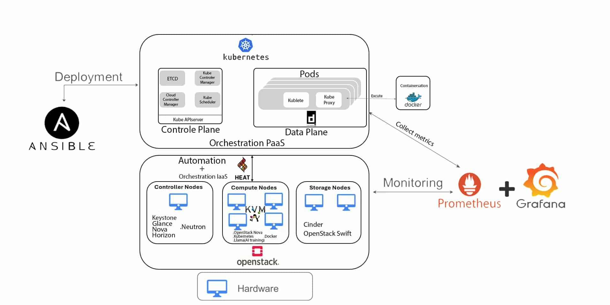

# Cloud Application Platform on OpenStack Kubernetes with Heat and Ansible

## Overview
This repository provides a comprehensive framework for deploying a cloud application platform on OpenStack Kubernetes using Heat templates and Ansible roles. This README will guide you through the architecture, components, and workflow involved in using this platform.

## Architecture
The architecture is designed to provide a scalable and manageable cloud application environment. Key components include:

- **OpenStack**: The foundation of the infrastructure, providing cloud computing resources.
- **Kubernetes**: The orchestration layer for managing containerized applications.
- **Heat**: The orchestration service within OpenStack for managing resources.
- **Ansible**: A tool for automating application deployment and configuration management.

The architecture diagram outlines the interaction between these components:



## Heat Templates
Heat templates define the infrastructure resources to be managed, including:
- **Compute Instances**: Virtual machines that run the application containers.
- **Network Resources**: Configuration of networks and subnets for the instances.
- **Storage Resources**: Definition of volumes and persistent storage for the applications.

The main Heat template is located in the `heat_templates/` directory. It can be modified to suit your specific requirements.

## Ansible Roles
Ansible roles are structured sets of tasks, variables, files, and templates that are used to define the configuration of your applications and services. This repository includes the following roles:
- **web_server**: Installs and configures a web server (e.g., Nginx, Apache).
- **database**: Sets up a database service (e.g., MySQL, PostgreSQL).
- **load_balancer**: Configures a load balancer to distribute traffic to application instances.

Each role can be found in the `ansible/roles/` directory, along with a `README.md` file explaining its specific usage.

## Deployment Workflow
The deployment workflow consists of the following high-level steps:
1. **Prepare your OpenStack Environment**: Ensure you have access to an OpenStack instance and the relevant credentials.
2. **Modify Heat Templates**: Customize the Heat templates as per your application requirements.
3. **Deploy Resources using Heat**: Use the OpenStack CLI or dashboard to deploy the Heat templates.
4. **Configure Applications with Ansible**:
   - Clone this repository.
   - Update the inventory file to include the target instances.
   - Run the deployment playbook using Ansible:
     ```bash
     ansible-playbook -i inventory deploy.yml
     ```
5. **Verify Deployment**: Access the deployed applications via the load balancer or direct instance IP addresses.

## Conclusion
This repository serves as a baseline for deploying a cloud application platform using OpenStack, Kubernetes, Heat, and Ansible. For advanced configurations and customizations, feel free to modify the provided templates and roles.

## License
This project is licensed under the MIT License - see the [LICENSE](LICENSE) file for details.
